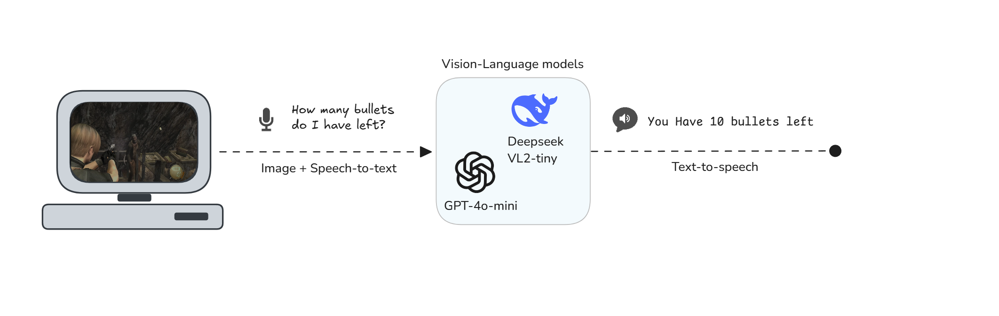
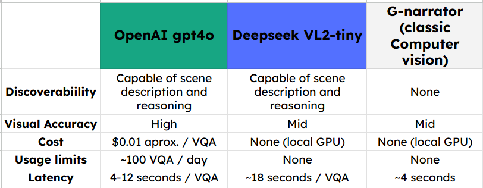

<h1 align="center">
 
     
    G-Narrator
     
    AI Augmented
     
    (Beta)
</h1>

# Concept
Exploring the idea of incorporating visual language models to the narrator to enhance its capabilities.
Below is a conceptual diagram illustrating how this integration might work. 

The system would use a Visual Question Answering (VQA) approach:
- Input: A visual question is presented to the system, often related to the contents of an image.
- Output: The system provides an answer based on the image and the question.

<h1 align="center">
 
</h1>

# Current Progress
- Conducting initial tests and evaluations.
- Analyzing the advantages, disadvantages, and limitations of this approach.

<h1 align="center">
 
</h1>

# Future Plans
Further development and refinement based on test results.

