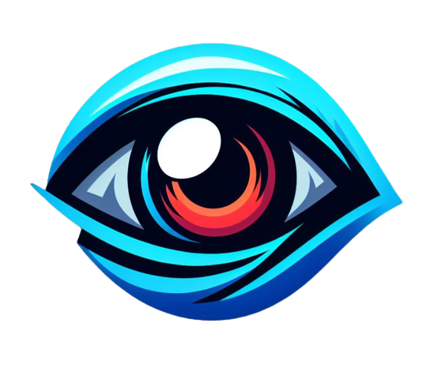

<h1 align="center">
 
     
    GNarrator
</h1>

<h4 align="center">
A screen reading accessibility tool for videogames
</h4>
 

 <strong>
  <a href="./docs/usage.md">Getting Started</a>
 </strong>

In many videogames, the use of the mouse for controlling the camera is often used. On the other hand, the magnifier app which makes the elements on the screen appear larger, also makes use of the movement of the mouse to move around the screen. These two behaviors collide between each other if they wanna be performed simultaneously. In other words, while playing a videogame one is not able to use the magnifier app and move the mouse around the screen. 
Adiotionally, tools like, for example, Windows Narrator do not work in these scenarios. 
This project is proposed as an easy-to-use and functional alternative that can work in any kind of scenario. 

## Usage
When it comes to usage, this app can be used by everyone. However, people having some kind of visual imparement will benefit the most from using it. Furthurmore, this application could also serve as inspiration for encouraging game developers to include this kind of accessibility feature inside their games. 

## Application demo
In the following video it is shown how the application works:
1. It starts by scanning the content of the screen.
2. Once scanned, the user can switch between all detected text bounding boxes.
3. When the read out loud key is pressed the text inside the selected bounding box is read. 

https://user-images.githubusercontent.com/13052324/214283712-3282a405-70bc-4821-b365-ccd43e37dae7.mp4
